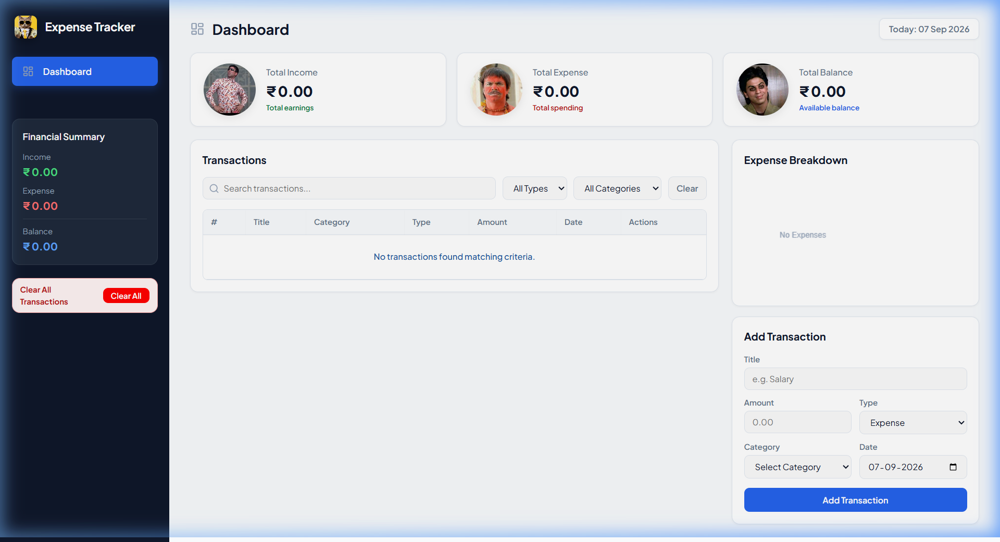
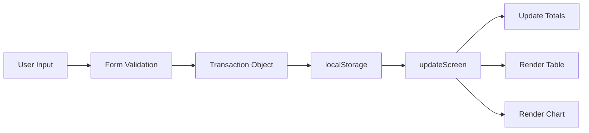

<div align="center">

# 💰 Expense Tracker

### A Modern Personal Finance Dashboard

[](https://developer.mozilla.org/en-US/docs/Web/HTML)
[](https://developer.mozilla.org/en-US/docs/Web/CSS)
[](https://developer.mozilla.org/en-US/docs/Web/JavaScript)
[](LICENSE)

A sleek, feature-rich expense tracker built with pure **HTML**, **CSS**, and **JavaScript**. Track your income, manage expenses, visualize spending patterns — all with a beautiful, responsive dashboard interface and zero external dependencies.

<br/>



<br/>

[**View Demo**](#-quick-start) · [**Report Bug**](https://github.com/Shubham-Praeclarum-Tech/Expense-Tracker/issues) · [**Request Feature**](https://github.com/Shubham-Praeclarum-Tech/Expense-Tracker/issues)

</div>

---

## 📋 Table of Contents

- [✨ Features](#-features)
- [🖥️ Screenshots](#-screenshots)
- [🏗️ Architecture](#-architecture)
- [📂 Project Structure](#-project-structure)
- [🚀 Quick Start](#-quick-start)
- [🛠️ Tech Stack](#-tech-stack)
- [📖 Usage Guide](#-usage-guide)
- [🎨 Design System](#-design-system)
- [📱 Responsive Design](#-responsive-design)
- [🤝 Contributing](#-contributing)
- [📄 License](#-license)

---

## ✨ Features

<table>
  <tr>
    <td width="50%">

### 📊 Dashboard Overview
- Real-time **income**, **expense**, and **balance** cards
- Interactive **donut chart** for expense breakdown by category
- Today's date display with live updates

</td>
    <td width="50%">

### 💳 Transaction Management
- Add transactions with **title**, **amount**, **type**, **category**, and **date**
- **Edit** existing transactions via a modal dialog
- **Delete** individual transactions with confirmation
- **Bulk clear** all transactions with safety prompt

</td>
  </tr>
  <tr>
    <td width="50%">

### 🔍 Search & Filtering
- **Real-time search** by transaction title
- Filter by **type** (Income / Expense)
- Filter by **category** (9 built-in categories)
- One-click **clear filters** reset

</td>
    <td width="50%">

### 🎨 UI & UX
- **Dark sidebar** with navigation and quick actions
- **Responsive design** — works on desktop, tablet, and mobile
- Smooth **transitions** and **hover effects**
- **Category badges** with color coding
- **Persistent data** via `localStorage`

</td>
  </tr>
</table>

---

## 🏗️ Architecture

```
┌──────────────────────────────────────────────────────────┐
│                     index.html                           │
│               (Structure & Layout)                       │
│                                                          │
│  ┌─────────────┐  ┌───────────────────────────────────┐  │
│  │   Sidebar    │  │            Main Content            │ │
│  │             │  │  ┌─────────────────────────────┐   │ │
│  │  • Logo     │  │  │       Metric Cards          │   │ │
│  │  • Nav      │  │  │  (Income/Expense/Balance)   │   │ │
│  │  • Clear    │  │  └─────────────────────────────┘   │ │
│  │    All      │  │  ┌──────────┐ ┌────────────────┐   │ │
│  │             │  │  │  Panel   │ │  + Add Form    │   │ │
│  └─────────────┘  │  └──────────┘ └────────────────┘   │ │
│                   └───────────────────────────────────┘  │
└──────────────────────────────────────────────────────────┘
         │                        │
         ▼                        ▼
┌─────────────────┐     ┌─────────────────┐
│    style.css    │     │    script.js     │
│   (Styling &    │     │  (Logic &        │
│   Responsive)   │     │   localStorage)  │
└─────────────────┘     └─────────────────┘
```

### Data Flow



---

## 📂 Project Structure

```
Expense-Tracker/
├── 📄 index.html              # Main HTML — app layout and structure
├── 🎨 style.css               # Complete styling with CSS variables & responsive design
├── ⚙️ script.js               # Core application logic and DOM manipulation
├── 📁 icons/                   # SVG icons for UI elements
│   ├── dashboard.svg           # Dashboard navigation icon
│   ├── delete.svg              # Delete action icon
│   ├── edit.svg                # Edit action icon
│   ├── expense.svg             # Expense type indicator
│   ├── income.svg              # Income type indicator
│   ├── search.svg              # Search input icon
│   └── warning.svg             # Warning/alert icon
├── 📁 images/                  # Image assets
│   ├── image copy.png          # App logo
│   ├── image copy 2.png        # Expense card icon
│   ├── image copy 3.png        # Income card icon
│   ├── image copy 4.png        # Balance card icon
│   └── dashboard-preview.png   # Dashboard preview screenshot
├── 📁 .vscode/                 # VS Code workspace settings
│   └── settings.json
└── 📄 README.md                # Project documentation (this file)
```

---

## 🚀 Quick Start

### Prerequisites

- Any modern web browser (Chrome, Firefox, Edge, Safari)
- No build tools, frameworks, or package managers required

### Installation

1. **Clone the repository**

   ```bash
   git clone https://github.com/Shubham-Praeclarum-Tech/Expense-Tracker.git
   ```

2. **Navigate to the project directory**

   ```bash
   cd Expense-Tracker
   ```

3. **Open in browser**

   ```bash
   # Simply open index.html in your browser
   # Or use a live server:
   npx serve .
   ```

   > **💡 Tip:** If you use VS Code, install the [Live Server](https://marketplace.visualstudio.com/items?itemName=ritwickdey.LiveServer) extension and click **"Go Live"** for hot-reloading during development.

---

## 🛠️ Tech Stack

| Technology | Purpose |
|:---|:---|
| **HTML5** | Semantic markup, accessibility, form handling |
| **CSS3** | Custom properties, Grid/Flexbox layout, responsive media queries, transitions |
| **Vanilla JavaScript** | DOM manipulation, localStorage API, Canvas API (donut chart), event handling |
| **Google Fonts** | [Plus Jakarta Sans](https://fonts.google.com/specimen/Plus+Jakarta+Sans) — modern, professional typography |

### Why No Framework?

This project intentionally uses **zero external dependencies** to demonstrate:

- 🎯 **Pure fundamentals** — deep understanding of HTML, CSS, and JavaScript
- ⚡ **Zero build time** — instant load, no bundling or compilation
- 📦 **Minimal footprint** — under 40KB total (excluding images)
- 🔧 **Easy to customize** — no framework abstractions or boilerplate

---

## 📖 Usage Guide

### Adding a Transaction

1. Fill in the **Title** (e.g., "Monthly Salary")
2. Enter the **Amount** (e.g., 50000)
3. Select the **Type** — `Income` or `Expense`
4. Choose a **Category** from the dropdown:
   | Income Categories | Expense Categories |
   |:---|:---|
   | Salary | Housing |
   | Work | Food |
   | Investment | Utilities |
   | | Education |
   | | Transportation |
   | | Others |
5. Pick a **Date**
6. Click **"Add Transaction"**

### Editing a Transaction

- Click the **✏️ edit** button on any transaction row
- Modify fields in the modal dialog
- Click **"Save Changes"** to update

### Filtering Transactions

- **Search**: Type in the search box to filter by title
- **Type Filter**: Select "Income" or "Expense" to narrow results
- **Category Filter**: Select a specific category
- **Clear**: Click the "Clear" button to reset all filters

### Clearing All Data

- Use the **"Clear All"** button in the sidebar
- A confirmation dialog prevents accidental deletion

---

## 🎨 Design System

### Color Palette

| Token | Hex | Usage |
|:---|:---|:---|
| `--bg-main` | `#F8FAFC` | Page background |
| `--bg-sidebar` | `#0F172A` | Sidebar dark background |
| `--primary-blue` | `#2563EB` | Primary actions, active states |
| `--green-dark` | `#15803D` | Income indicators |
| `--red-dark` | `#B91C1C` | Expense indicators |
| `--text-primary` | `#0F172A` | Headings, body text |
| `--text-secondary` | `#64748B` | Labels, muted text |

### Typography

- **Font Family**: Plus Jakarta Sans (weights: 400, 500, 600, 700, 800)
- **Heading Scale**: 22px → 18px → 16px → 14px → 12px

### Spacing & Radius

| Token | Value |
|:---|:---|
| `--radius-sm` | `8px` |
| `--radius-md` | `12px` |
| `--radius-lg` | `16px` |
| `--radius-full` | `9999px` |

---

## 📱 Responsive Design

The app adapts seamlessly across all screen sizes:

| Breakpoint | Layout Changes |
|:---|:---|
| **> 1200px** | Full sidebar + 2-column grid layout |
| **992px – 1200px** | Narrower grid, compact panels |
| **768px – 992px** | Stacked layout, 2-column right stack |
| **< 768px** | Mobile: sidebar on top, single column layout |
| **< 480px** | Compact spacing, smaller fonts and chart |

---

## 🤝 Contributing

Contributions are welcome! Here's how you can help:

1. **Fork** the repository
2. **Create** your feature branch

   ```bash
   git checkout -b feature/amazing-feature
   ```

3. **Commit** your changes

   ```bash
   git commit -m "Add: amazing feature"
   ```

4. **Push** to the branch

   ```bash
   git push origin feature/amazing-feature
   ```

5. **Open** a Pull Request

### Commit Convention

| Prefix | Usage |
|:---|:---|
| `Add:` | New features |
| `Fix:` | Bug fixes |
| `Update:` | Improvements to existing features |
| `Refactor:` | Code restructuring |
| `Style:` | UI/CSS changes |
| `Docs:` | Documentation updates |

---

## 📄 License

This project is licensed under the **MIT License** — see the [LICENSE](LICENSE) file for details.

---

<div align="center">

### Built with ❤️ by [Praeclarum Tech](https://github.com/Shubham-Praeclarum-Tech)

⭐ **Star this repo** if you found it useful!

</div>
